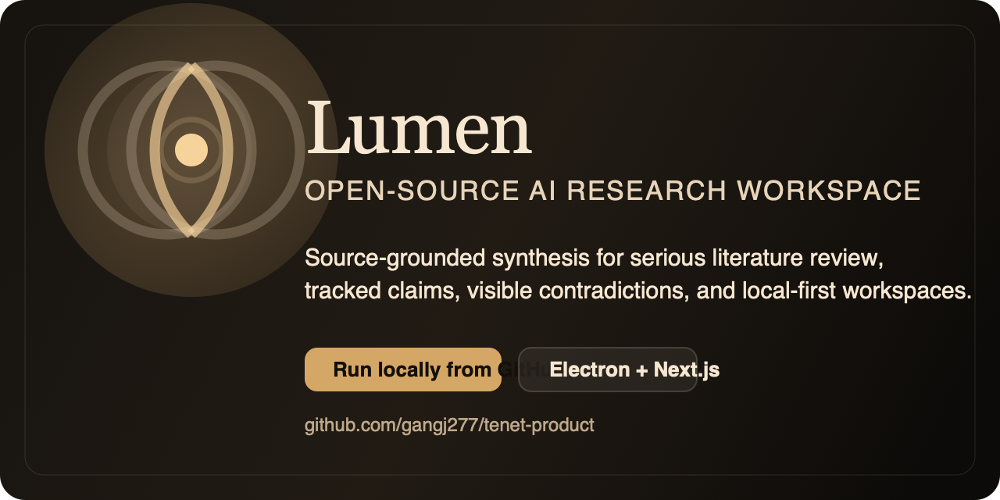

# Lumen

Open-source AI-native research workspace for source-grounded synthesis, tracked claims, visible contradictions, and thesis development.



## Why Lumen

Most AI research tools give you polished prose with weak provenance.

Lumen is built for the opposite workflow:

- ingest your real sources
- keep artifacts editable as workspace files
- surface contradiction and uncertainty instead of flattening it
- help you turn reading into a thesis, not just a summary

## Primary Install Path

Lumen’s primary open-source path is local-from-GitHub, not a signed macOS download.

If you want the fastest local bootstrap:

```bash
npx degit gangj277/tenet-product lumen
cd lumen
npm install
npx codex login
npm run electron:local
```

This path:

- clones the repo without git history
- installs dependencies locally
- builds the standalone app
- launches Electron in local-production mode with filesystem-backed storage

## Contributor Install Path

If you want git history and a normal contributor workflow:

```bash
git clone https://github.com/gangj277/tenet-product.git
cd tenet-product
npm install
npx codex login
npm run electron:local
```

For active development with hot reload:

```bash
npm run electron:dev
```

## What `electron:local` Does

`npm run electron:local` is the repo’s real local-run path.

It will:

1. compile the Electron main and preload process
2. build Next.js in standalone mode
3. launch Electron against the built standalone server
4. use local filesystem storage for projects and credentials

Use this when you want the app the way end users should run it from source.

Use `npm run electron:dev` only when you are actively developing the app and want HMR.

## Requirements

- Node.js 20+
- npm
- a local Codex login for authentication:

```bash
npx codex login
```

## Repository Map

- [`app`](./app): Next.js app routes and UI
- [`electron`](./electron): Electron main/preload runtime
- [`lib`](./lib): research engine, auth, storage, and workspace logic
- [`tests`](./tests): regression and route tests
- [`docs`](./docs): product, launch, and implementation notes

## Core Commands

```bash
# local production-style Electron run
npm run electron:local

# contributor Electron dev mode
npm run electron:dev

# web dev mode with PostgreSQL
npm run dev

# compile Electron only
npm run electron:compile

# production web build
npm run build

# full test suite
npm test
```

## Current Product Shape

Lumen currently focuses on:

- local-first Electron research workspaces
- structured artifact generation
- source-grounded chat and editing
- visible workspace files for notes, artifacts, papers, experiments, and source summaries

Signed desktop installers may come later. For now, the supported open-source story is:

- clone the repo
- log into Codex locally
- run `npm run electron:local`

## Contributing

Start with [`CONTRIBUTING.md`](./CONTRIBUTING.md).

If you find a bug or a broken research workflow, open an issue with:

- what you were trying to do
- the exact source type or file involved
- what you expected
- what happened instead

## Citation

If you use Lumen in research or academic writing, please cite the repository using [`CITATION.cff`](./CITATION.cff).

## License

MIT. See [`LICENSE`](./LICENSE).
